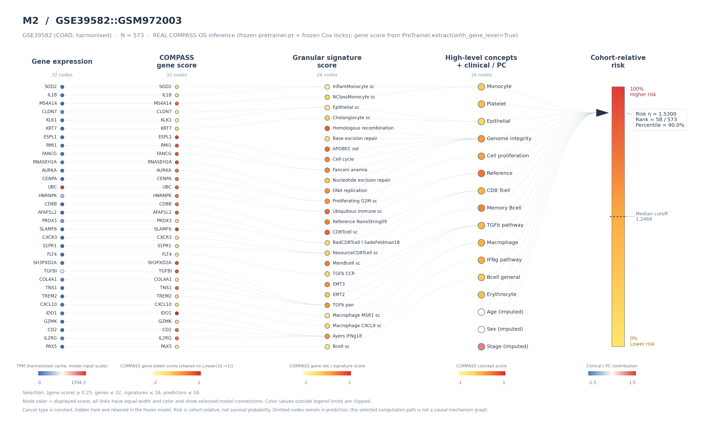

<div align="center">

# COMPASS-OS

**基于 COMPASS 表征的泛癌生存风险预测**

冻结模型推理 · 43 个概念 · 132 个基因签名 · 覆盖度质控 · 样本计算路径

[English](README.md) · **简体中文**

[](https://github.com/RENSI203/COMPASS-OS/releases/tag/v1.1.0)
[](pyproject.toml)
[](LICENSE)

[快速开始](#快速开始) · [样本路径图](#样本路径图) · [文档导航](#文档导航) · [引用](#引用)

</div>

---

COMPASS-OS 是一个用于 **bulk 转录组总体生存风险预测**的 Python 包。软件将冻结的 COMPASS 编码器与基于 TCGA 训练的 Cox 模型结合，一次分析即可获得风险分数、分子表征和输入质控结果。

模型资产随包分发。推理使用冻结参数，不在用户提交的队列上训练、重新拟合或调参。

| 功能 | 输出 |
|---|---|
| **预后风险计算** | 每个样本的 Cox 线性预测子 η = Xβ |
| **队列风险分层** | 队列内排序；达到样本量要求时提供高/低风险分组 |
| **43 个概念表征** | 用于下游关联与探索的 COMPASS 隐坐标 |
| **132 个基因签名表征** | 基因集层面的模型读数 |
| **覆盖度质控** | 全局、signature 相关基因、逐 signature 和 concept 输入覆盖度 |
| **报告与样本路径图** | 结果表、报告图及单样本分层计算路径展示 |

分子表征用于生成研究假设。单凭数值方向，不能判定通路激活、抑制或因果机制。

## 安装

从 [GitHub Releases](https://github.com/RENSI203/COMPASS-OS/releases/tag/v1.1.0) 下载 wheel 后安装：

```bash
python -m pip install compass_os-1.1.0-py3-none-any.whl
```

也可以从仓库安装：

```bash
git clone https://github.com/RENSI203/COMPASS-OS.git
cd COMPASS-OS
python -m pip install .
```

包元数据声明 Python ≥3.10。pip 会安装 PyTorch、torchvision 等运行依赖；当前版本要求 `matplotlib>=3.7,<3.9`。完整依赖见 [pyproject.toml](pyproject.toml)。

COMPASS checkpoint、冻结模型资产和上游源码副本均随包分发。**安装完成后，无需配置仓库路径或环境变量。**

## 快速开始

准备 `expression.tsv`：**行是样本，列是基因 symbol，第一列是样本 ID**。对于单癌种队列：

```python
import compass_os

result = compass_os.analyze(
    "expression.tsv",
    cancer_type="LUAD",
    input_scale="tpm",
)

print(result.summary())
result.save_report("compass_results/")
```

临床变量和生存随访可选：

```python
result = compass_os.analyze(
    "expression.tsv",
    cancer_type="LUAD",
    clinical="clinical.tsv",    # age、sex、stage；以样本 ID 为索引
    survival="survival.tsv",    # time、event；以样本 ID 为索引
    input_scale="tpm",
)
```

`analyze()` 使用冻结 manifest 指定的模型：**v1.1.0 中为 M2**。下方参数化接口可以显式选择 M3。混合癌种队列需按表达矩阵的行顺序，为每个样本提供对应癌种缩写。

克隆仓库后，可运行自带示例：

```bash
python examples/quick_start.py
```

## 样本路径图

<p align="center">
  
</p>

*示例：GSE39582（COAD）队列中的一个高风险样本，使用 M2。该图展示经过筛选的计算路径，不是因果机制图或通路激活图。*

圆形分层图分别展示基因表达、COMPASS gene score、signature score 和高层预测变量。节点颜色表示该层数值，统一细线表示筛选后的模型连接。风险柱显示样本在队列中的相对位置、三角标记和 cutoff 虚线。

```python
import pandas as pd
import compass_os

expr = pd.read_csv("expression.tsv", sep="\t", index_col=0)
expr.index = expr.index.map(str)
sample_id = expr.index[0]

path = compass_os.sample_path(
    expr,
    cancer_type="LUAD",
    sample_id=sample_id,
    model="M3",
    input_scale="tpm",
)

print(path.summary())
path.save("compass_results/sample_path")
```

请提交包含目标样本的队列，以便解释其排名和百分位。`save()` 导出 HTML、PNG、PDF、SVG、可见节点数值、筛选 metadata 及完整 Cox contribution 分解。也支持单独导出：

```python
path.save_html("sample_path.html")
path.save_static("sample_path.pdf")    # 也支持 .png、.svg
```

- HTML 内嵌同一张 PNG，并提供可展开的精确节点表；主图是静态版本。
- 用冻结参考值填补的临床字段标为 **imputed**；PC1–PC10 聚合为一个节点。
- 图中的默认 cutoff 是**当前队列的中位风险**，属于可视化分界，与预测使用的冻结切点不同。
- 支持 M1、M2、M3。M0 没有 COMPASS concept 分支，不支持此表示层路径图。

展示阈值、节点数量及颜色范围均可配置。详见[样本路径图指南](docs/SAMPLE_PATH.md)与[可运行示例](examples/sample_path_example.py)。

## 输入与输出

### 输入要求

| 输入 | 要求 |
|---|---|
| 表达矩阵 | 样本 × 基因；列名为 gene symbol，索引为样本 ID |
| 表达尺度 | `input_scale="tpm"` 或 `input_scale="log2_tpm1"` |
| 癌种 | 必填；每个样本对应一个支持的 TCGA 肿瘤缩写。`analyze()`、`sample_path()` 对单癌种队列支持传入一个字符串 |
| 临床信息 | 可选数值列 `age`、`sex`、`stage`；使用冻结模型规定的编码，并按样本 ID 对齐 |
| 生存随访 | 可选时间/事件列；时间单位一致，并按样本 ID 对齐 |

缺失临床值使用冻结训练参考值填补，并在报告中说明；缺失基因按所选策略处理。请正确声明尺度：**非负 counts 或原始强度可能在数值上类似 TPM**，软件无法可靠推断其单位。原始微阵列强度不是直接支持的输入尺度。

### 分析结果字段

| 字段 | 含义 |
|---|---|
| `result.risk` | Cox 线性预测子 η；值越高，模型估计的风险越高 |
| `result.risk_rank` | 可用时提供队列内排序 |
| `result.risk_group` | 可用时按冻结切点给出高/低风险分组 |
| `result.risk_group_relative` | 返回时单独标注的队列中位分组，仅用于展示 |
| `result.concept_scores` | 样本 × 43 个概念表征 |
| `result.signature_scores` | 样本 × 132 个基因签名表征 |
| `result.qc` | 输入覆盖度与工程 QC 分级 |

`risk` **不是概率**：η 位于对数相对风险尺度，`exp(η)` 才是相对 hazard 倍数。基于训练基线风险推导的绝对生存输出具有另外的校准限制。

单样本预测不提供排名或高/低风险分组。默认情况下，至少两个样本可排序，至少 30 个样本才提供预测分组。冻结切点不保证外部队列均衡分组。应在明确的队列中解释排名，比较样本时考虑癌种构成。

## 参数化使用

常规分析使用一键式 `analyze()`。需要显式指定模型或缺失基因策略时，使用 `predict()`、`get_representation()` 或 `check_robustness()`：

```python
import pandas as pd
import compass_os

expr = pd.read_csv("expression.tsv", sep="\t", index_col=0)
expr.index = expr.index.map(str)
ct = ["LUAD"] * len(expr)       # 底层 API：每个样本提供一个癌种标签

pred = compass_os.predict(
    expr,
    ct,
    model="M3",
    input_scale="tpm",
    missing_gene_strategy="reference",
)

print(pred.risk)
print(pred.concept_scores.shape)
print(pred.signature_scores.shape)
```

| 模型 | 冻结预测变量 |
|---|---|
| M0 | 癌种 + 年龄/性别/分期 |
| M1 | 43 个 COMPASS concepts |
| **M2 — 默认** | 癌种 + 年龄/性别/分期 + 43 个 concepts |
| M3 | M2 + 冻结表达 PCA 的 PC1–PC10 |

| 缺失基因策略 | 行为 |
|---|---|
| **`reference` — 默认** | 使用冻结参考中位数填补 |
| `zero` | 先经过冻结 scaler，再将缺失基因的标准化输入值设为零 |
| `strict` | 缺少必需基因时直接报错 |

`zero` 是标准化输入空间的掩码操作，并不表示未测量基因的 TPM 为零。全局与 signature 相关基因 QC 属于工程分级；逐 signature 覆盖度仍作为连续指标。模型内部参数冻结，不提供公开的重新拟合接口。

临床编码、批处理、稳健性比较及派生生存输出详见[进阶用法](docs/ADVANCED_USAGE.md)。

## 验证证据与解释边界

发布文档报告了预设容差内的数值复现、外部输入覆盖度和缺失基因 stress test。38 个可还原外部队列在填补前的覆盖度中位数为：**全局 96.7%**，**本发布版本 916 个 signature 相关基因 96.2%**。指标定义与测试条件见[缺失基因证据](docs/MISSING_GENES.md)和[验证设计](docs/VALIDATION_DESIGN.md)。

解释时应保留以下边界：

- 审计所用的 24 队列 M2 比较**未检出相对临床基线的显著增量**；不能据此声称等效或优于临床基线。
- concept/signature 是模型表征，不是独立验证的通路活性测量；其符号本身不代表生物学激活或抑制。
- 风险与 Cox 入模特征之间的关联属于模型关联，不能作为独立机制证据。
- 这些读数可补充全转录组下游分析；不应根据 signature 成员身份限制机制发现中的候选基因。
- 覆盖度 QC 与缺失稳健性适用于已测试条件，不能外推为任意平台或任意缺失机制下都可靠。
- 个体绝对生存校准和新队列中的分层迁移性需要另外验证。

## 文档导航

| 文档 | 内容 |
|---|---|
| [进阶用法](docs/ADVANCED_USAGE.md) | 模型选择及参数化 API |
| [API 参考](docs/API.md) | 公开接口与结果对象 |
| [样本路径图](docs/SAMPLE_PATH.md) | 图形含义、展示参数及导出 |
| [缺失基因](docs/MISSING_GENES.md) | 填补、掩码、覆盖度 QC 及稳健性证据 |
| [概念语义](docs/CONCEPT_SEMANTICS.md) | 43/132 表征层的解释 |
| [验证设计](docs/VALIDATION_DESIGN.md) | 验证设置及测试范围 |
| [发布说明](RELEASE_NOTES_v1.1.0.md) | v1.1.0 的变化 |

示例：[快速开始](examples/quick_start.py) · [队列分析](examples/cohort_example.py) · [缺失基因](examples/missing_genes_example.py) · [样本路径图](examples/sample_path_example.py)。

## 引用

使用本软件时，请同时引用 **COMPASS-OS 和上游 COMPASS 论文**。软件引用信息统一维护在 [CITATION.cff](CITATION.cff)，GitHub 的 **Cite this repository** 入口提供引用格式。

COMPASS-OS 软件作者：**Jiahao Ren、Junyi Xin**。COMPASS 预训练模型及上游源码副本保留原作者归属。

## 许可与联系

COMPASS-OS 采用 [MIT License](LICENSE)。上游归属信息见 [NOTICE](NOTICE) 和[随包分发的 COMPASS 许可证](src/compass_os/assets/third_party/COMPASS_LICENSE)。

问题和可复现的 bug 报告请提交到 [GitHub Issues](https://github.com/RENSI203/COMPASS-OS/issues)。

联系：**Jiahao Ren** — [rjh2623826975@stu.njmu.edu.cn](mailto:rjh2623826975@stu.njmu.edu.cn)。

---

[English](README.md) · [发布下载](https://github.com/RENSI203/COMPASS-OS/releases/tag/v1.1.0) · [返回顶部](#compass-os)
